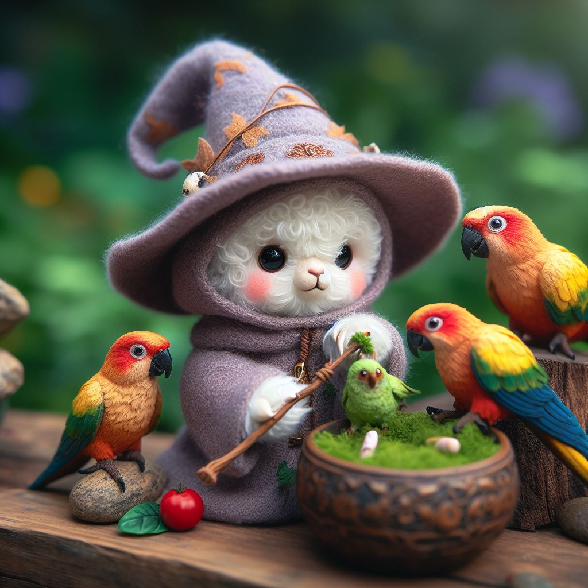

# Chronicles (of Aethelgard)



## Generate NPC data

```bash
cd generate-npc
KIND=dragon docker-compose up --abort-on-container-exit
```

The data will be generated in the `./data/` directory. And the name of the file will be something like: `character-<KIND>-<NAME>.json` (ex: `character-dragon-lorinirion.json`)

## Use the data to create a bot

Copy the file to `bot-npc/data`.

```bash
cd bot-npc
CHARACTER_DATA=./data/character-dragon-lorinirion.json  docker-compose up 
```

Then you can query the new bot:

```bash
SERVICE_URL="http://localhost:5051"

read -r -d '' DATA <<- EOM
{
  "question":"What is your name and your kind?"
}
EOM

echo "Sending question: ${DATA} on ${SERVICE_URL}"
echo ""

curl --no-buffer ${SERVICE_URL}/api/chat \
    -H "Content-Type: application/json" \
    -d "${DATA}" 

echo ""
```

## Start several bots

```bash
cd bot-npc
docker-compose --file ./compose-bots.yml up
```
